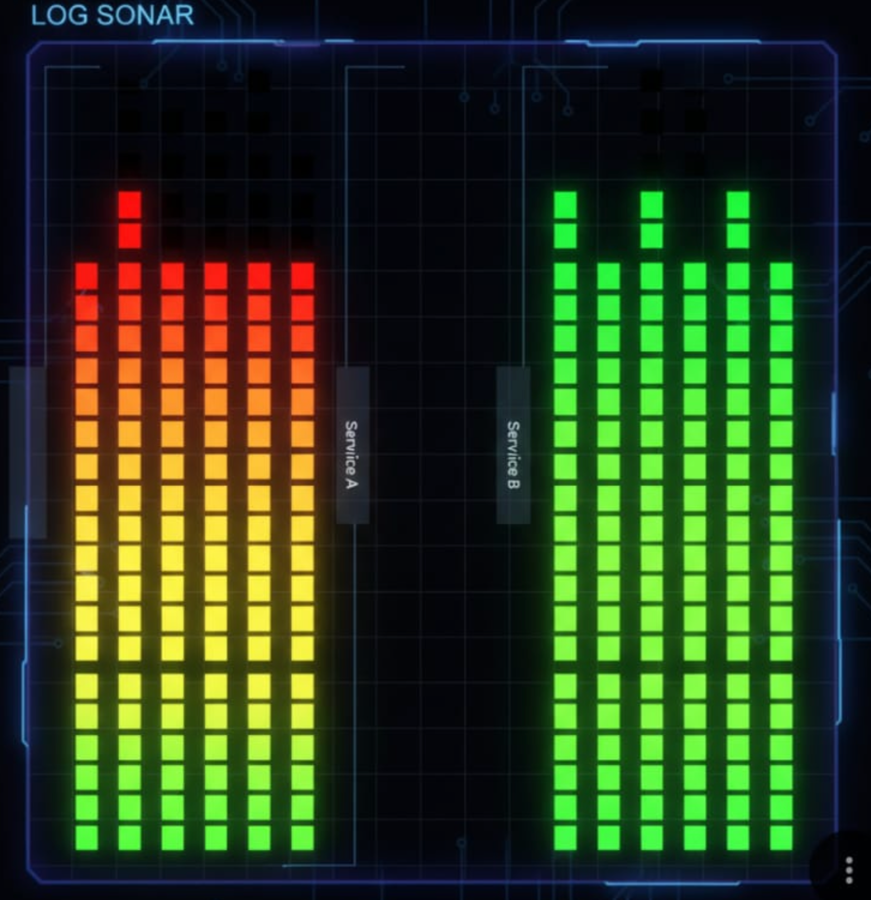

# logSonar

A new way of visualising logs

Generally, when we want to visualise logs from a distributed system, we use grafana/prometheus and get some metrics and understanding of what is happening to the system and have some sort of filtering and sorting to it. But i felt that those charts and graphs never gave me a quick "feel" of performance of any particular node.

### My solution:

Most of the application that are setup in a distributed way already have some sort of log collection techniques for example Otel Collectors..
Now My application runs on top of this Otel and visualised it in a different way.

### How does the visualisation process look like?

- As an example, here right now i have a flask application(toy application) which generates sample logs with few parameters like service, timestamp, latency, message.
- Now, the actual logic is in the processLogic which takes in the emitted json from the above application and processes it. if i simplify the explanation of prcoessing, it basically gives different weights to each parameter and normalises it to a value between 0 - 255 and 3 of them(if you felt something, you are right!)
- now the normalised values have the essense of the response of the JSON response and we could say that it got "translated" into something new. - The Interesting thing is that, these 3 values can be represented as (R, G, B) and this will represent a pixel.
- Now my planning is that, we could get a batch of logs and get the pixels filled up WRT to a particular service(check the bellow sample image) and then we can have an understanding, if there are any repetition of issues of any particular service or node.



### The process
1. Uses KMeans to get the scemantic representation, "healthy, Fast, light.."
    - Basically means of the cluster will be (R, G, B) values which decide how the overall health of the service looks like 
2. Uses FFT to find the repetition of patterns 
    - Say, the service is repeatedly being slowed by some process(say DB connection) every 1 min
    Our FFT will show that anomaly. 
3. Finally, we find the find the mean pixel value throught the service, which then is compared with every 
    other pixel and any pixel with more than 20% deviation, is added to the anamoly list. 

### Plotting
1. The entire image is split per service
2. The entire image analysis is done per service(the FFT, Kmeans, Anomoly detection)
3. The FFT for each service is plotted to analyse any patterns, if not found directly in the image. 

## How to run the application

To see the system in action, you need to run both the log ingestion server (Painter) and the sample traffic generator side-by-side in separate terminal windows.

### 1. Start the Ingest Server (Painter)
This server acts as the central pipeline. It listens on port 8000 to accept incoming JSON logs, maps their metrics to an RGB pixel representation, and handles image generation and semantic analysis automatically when the pixel buffer is full.

```bash
# From the logSonar directory
python processLogic/painter.py
```

### 2. Start the Toy Application
Once the ingest server is running, start the toy traffic generator. This simulates three distinct microservices (with specific profiles like "Reliable API" or "Heavy Worker with errors") and feeds their logs straight to the pipeline via `http://localhost:8000/ingest`.

```bash
# In a new terminal, from the logSonar directory
python toy-application/toy_app.py
```

*Note: As logs buffer and images are generated, check the `generated_images/` and `analysis_output/` folders for the visual observability outputs.*